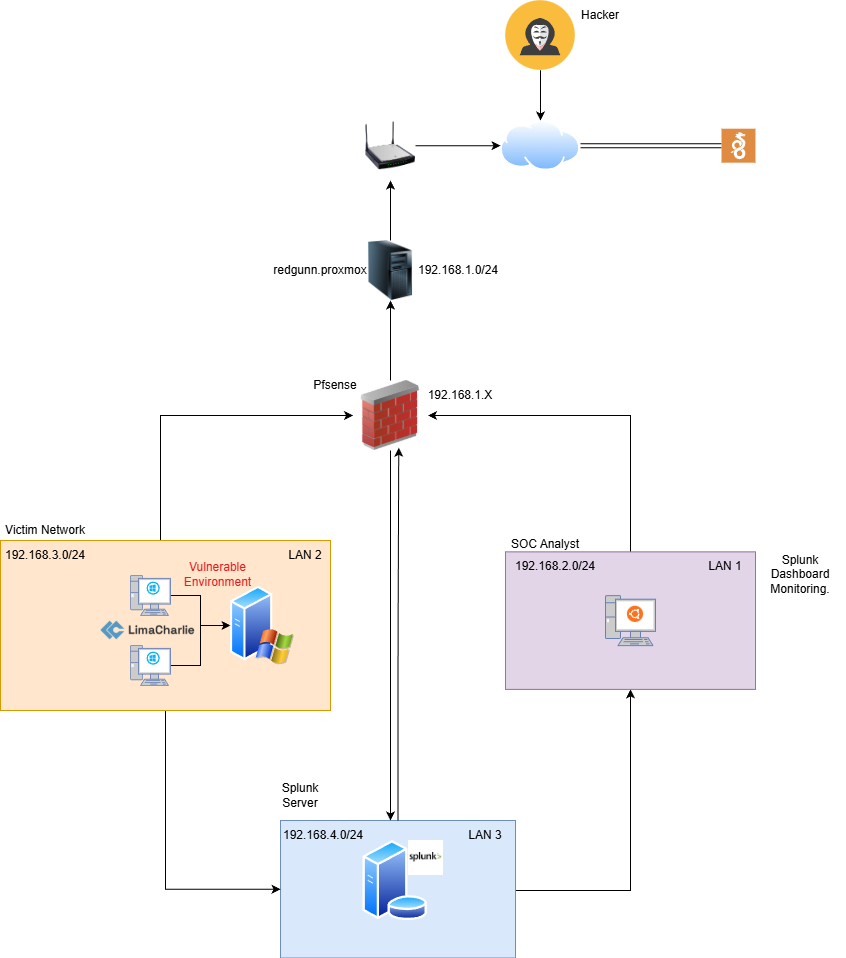

## 🧩 Part 1 — Network Design & Topology

Before deploying systems or forwarding logs, I knew the foundation had to be right. If I wanted this lab to behave like a real enterprise environment, the network design couldn’t be an afterthought. This phase was about slowing down and thinking like an engineer and a SOC analyst at the same time*how should traffic flow, and just as importantly, what should never be allowed?*

---

## 🗺️ Network Topology Diagram

  

  <em>Figure 1: Segmented homelab network architecture using Proxmox, pfSense, and Splunk</em>

The diagram represents how Proxmox, pfSense, and the segmented LANs interact within the lab. It reflects the mindset I adopted early on: **assume isolation first, then allow access only when it’s justified**.

---

At the heart of the design is a **segmented network architecture**, where every network is isolated by default and all communication is forced through a central control point. Rather than using a flat network for convenience, I wanted the structure to resemble what I was seeing in real client environments.

That control point is **pfSense**, acting as the central gateway responsible for routing, firewall enforcement, and traffic control between all segments. Nothing moves between networks unless pfSense explicitly allows it.

---

### 🔐 Network Segmentation Overview

To keep things realistic, I split the environment into multiple logical segments, each with a clear role:

| Segment | Subnet | Purpose |
|-------|--------|--------|
| WAN | 192.168.1.0/24 | Internet uplink |
| LAN 1 | 192.168.2.0/24 | Linux systems and baseline testing |
| LAN 2 | 192.168.3.0/24 | Windows Server and user endpoints |
| LAN 3 | 192.168.4.0/24 | Security tools and logging (Splunk) |

Each LAN is treated as its own security zone. By default, **no LAN trusts another**. If two systems need to talk, I have to consciously allow it.

---

### 🧱 Virtualization & Network Layout

Since everything runs on Proxmox, segmentation starts at the hypervisor level. I mapped each network segment to its own Linux bridge:

| Proxmox Bridge | Connected Network |
|--------------|------------------|
| vmbr0 | WAN |
| vmbr1 | LAN 1 |
| vmbr2 | LAN 2 |
| vmbr3 | LAN 3 |

Virtual machines are connected only to the bridge that matches their intended role. This prevents accidental cross-network access and reinforces the idea that segmentation isn’t just a firewall concept it’s layered.

---

### 🔥 pfSense Interface Design

pfSense is configured with a dedicated interface for each network:

| Interface | IP Address | Network |
|---------|------------|---------|
| WAN | 192.168.1.10 | Internet |
| LAN 1 | 192.168.2.1 | LAN 1 |
| LAN 2 | 192.168.3.1 | LAN 2 |
| LAN 3 | 192.168.4.1 | LAN 3 |

Each interface acts as the default gateway for its network, making pfSense the single enforcement point for all routing and security decisions.

---

### 🔄 Traffic Flow Philosophy

From the beginning, I followed a few simple rules:

- Outbound internet access is allowed from all LANs.
- Inter-LAN traffic is **blocked by default**.
- Exceptions exist only for **centralized logging and required services**.
- Every exception must be intentional, minimal, and traceable.

This approach forces discipline and mirrors real-world environments, where visibility and control matter more than convenience. It also sets the stage for later phases detection, logging, and investigation by ensuring that every packet has a reason to exist.

---
---

⬅️ **Previous:** [Main Project Overview](../README.md)  
➡️ **Next:** [Part 2 — Environment Capture & Baseline](../Part-2/README.md)
