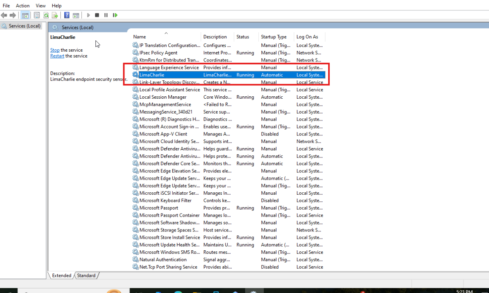
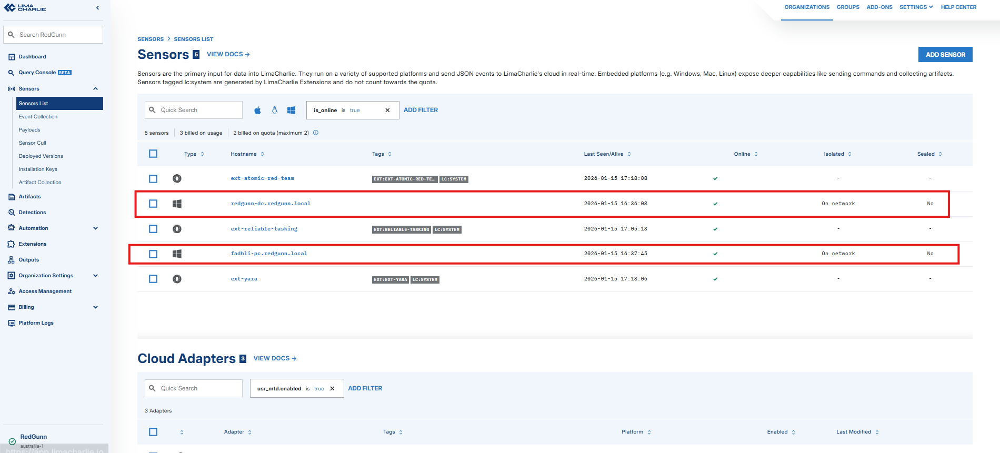
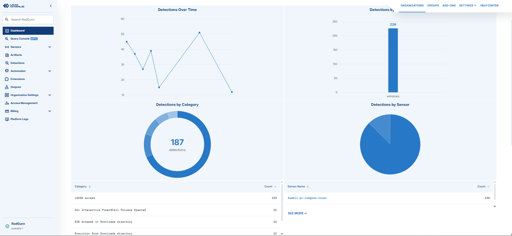

## 🔐 Part 3 — Security Controls, Segmentation Enforcement & Log Flow

With the environment deployed and captured in a known-good state, the next step was to ensure that the network behaved exactly as intended. From a SOC perspective, architecture alone has no value unless security controls are consistently enforced and observable.

This phase focuses on how segmentation is applied, how exceptions are deliberately introduced, and how visibility is maintained across all isolated segments.

---

## 🔥 Firewall Segmentation Rules

pfSense acts as the single enforcement point for all traffic entering or leaving each network segment.  
Segmentation is enforced using a **default-deny model**, with exceptions made only where operationally justified.

LAN 1 is intentionally designed as a **testing and experimentation network**, while LAN 2 and LAN 3 remain strictly isolated.

---

### Segmentation Policy Summary

| Source | Destination | Action | Purpose |
|------|-------------|--------|--------|
| LAN1 | Any | Allow | Testing and controlled experimentation |
| LAN2 | LAN1 | Block | Prevent lateral movement into testing zone |
| LAN2 | LAN3 | Block | Enforce isolation of logging network |
| LAN3 | LAN1 | Block | Protect testing environment |
| LAN3 | LAN2 | Block | Protect Windows environment |
| LAN2 | Internet | Allow | Normal outbound access |
| LAN3 | Internet | Allow | Updates and required services |

> 📸 **Firewall Rules — Visual Evidence**  
> The following screenshots demonstrate how segmentation is enforced across LAN 1, LAN 2, and LAN 3 using pfSense.

---

### 🔐 LAN 1 — Testing Network Rules

  

  <em>Figure 1: pfSense firewall rules for LAN 1 (testing network)</em>

LAN 1 is intentionally configured with broader access to support testing and experimentation, while still maintaining explicit logging controls.

---

### 🔐 LAN 2 — Windows Environment Isolation

  

  <em>Figure 2: pfSense firewall rules enforcing isolation for LAN 2</em>

LAN 2 is strictly isolated to reduce lateral movement risk from Windows-based systems and to protect other segments.

---

### 🔐 LAN 3 — Logging Infrastructure Protection

  

  <em>Figure 3: pfSense firewall rules protecting the logging network (LAN 3)</em>

LAN 3 is treated as a protected security zone. It accepts inbound logging traffic only and does not permit outbound access to other LANs.

---

## 🔓 Logging Exception Rules (Explicit Allow)

Although LAN 1 has broader access by design, **logging traffic remains explicitly defined and controlled** to preserve visibility and prevent unnecessary exposure.

| Source | Destination | Port | Action | Purpose |
|------|-------------|------|--------|--------|
| LAN1 | 192.168.4.10 | 9997 | Allow | Send test system logs to Splunk |
| LAN2 | 192.168.4.10 | 9997 | Allow | Send Windows logs to Splunk |
| LAN3 | Local | N/A | Allow | Local log processing |

All other inter-LAN services remain blocked unless explicitly required and documented.

> 📸 **Logging Exception Rules — Visual Evidence**  
> The following screenshots show the explicit firewall rules permitting log traffic to the Splunk server.

---

### 🔓 LAN 1 → Splunk (Port 9997)

  

  <em>Figure 4: pfSense rule allowing LAN 1 systems to forward logs to Splunk on port 9997</em>

---

### 🔓 LAN 2 → Splunk (Port 9997)

  

  <em>Figure 5: pfSense rule allowing LAN 2 systems to forward logs to Splunk on port 9997</em>

---

## 📊 Centralized Logging Architecture

All systems forward logs to a **dedicated Splunk server located in LAN 3 (192.168.4.10)**.  
This provides centralized visibility while maintaining strict separation of critical infrastructure.

Splunk is responsible for:

- Log ingestion
- Indexing and storage
- Event correlation
- Detection and alerting (future phase)

---

## 🛡️ Endpoint Detection & Response (EDR) — LimaCharlie Integration

To complement centralized logging and strengthen endpoint visibility, **LimaCharlie EDR** was deployed within the vulnerable Windows environment in **LAN 2**. While Splunk provides log aggregation and correlation, LimaCharlie introduces **real-time endpoint telemetry and detection capabilities** at the host level.

This layered approach mirrors enterprise security architectures where **SIEM and EDR operate together**, each serving a distinct but complementary role.

---

### 🎯 EDR Deployment

LimaCharlie agents are installed on selected Windows systems within the **victim network (LAN 2 — 192.168.3.0/24)**.

  

  <em>Figure 6: LimaCharlie service successfully installed and running</em>

  

  <em>Figure 7: Endpoint visible and reporting in the LimaCharlie console</em>

---

### 🔄 Telemetry & Visibility Model

With LimaCharlie in place, the lab now supports **dual visibility layers**:

| Tool | Visibility Type | Purpose |
|----|----|----|
| Splunk | Centralized logs | Aggregation, correlation, investigations |
| LimaCharlie | Endpoint telemetry | Real-time detection, process activity, host behavior |

This integration enables realistic SOC workflows, including:

- Detecting suspicious activity at the endpoint (EDR)  
- Correlating endpoint behavior with network and system logs (SIEM)  
- Validating blocked lateral movement attempts  
- Supporting future incident response and attack simulation phases  

  

  <em>Figure 8: LimaCharlie detection or telemetry view</em>

---

### 🧠 Design Rationale

- EDR provides **host-level context** that logs alone cannot  
- Cloud-based EDR avoids expanding internal trust zones  
- Separation of SIEM and EDR reflects real-world deployments  
- Enhances detection readiness without compromising segmentation  

---

## 🔄 Log Flow Design

Log flows are intentionally unidirectional and minimal.

### Linux Systems (LAN 1 — Testing)
- System and application logs forwarded via syslog or Splunk Universal Forwarder
- Destination: Splunk server (192.168.4.10:9997)

### Windows Systems (LAN 2)
- Windows Event Logs forwarded using Splunk Universal Forwarder
- Destination: Splunk server (192.168.4.10:9997)

### Splunk Server (LAN 3)
- Receives logs locally
- Receives logs from LAN 1 and LAN 2
- Serves as the central analysis and investigation point

  

  <em>Figure 9: Splunk input configuration showing port 9997 enabled for log ingestion</em>

---

  

  <em>Figure 10: Splunk UI showing events received from multiple isolated hosts</em>

---

## 🔍 Security Visibility & Monitoring

Centralized logging enables:

- Validation of segmentation and firewall effectiveness
- Detection of anomalous or unexpected activity
- Correlation of events across isolated systems
- Investigation of simulated security incidents

This phase establishes the foundation required for SOC-style detection and response workflows.

---

## 🧠 Security Design Principles

- Enforce segmentation using default-deny rules
- Allow broader access only where operationally justified (LAN 1)
- Maintain strict isolation for Windows and logging infrastructure
- Centralize and protect log collection
- Document the intent behind every exception

This ensures the environment remains controlled, observable, and aligned with real-world defensive practices.

---

⬅️ **Previous:** [Part 2 — Environment Capture & Baseline](../Part-2/README.md)  
➡️ **Next:** [Part 4 — Outcomes & Next Steps](../Part-4/README.md)
