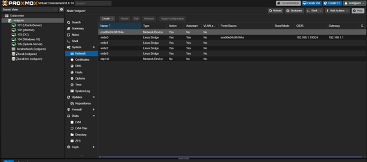
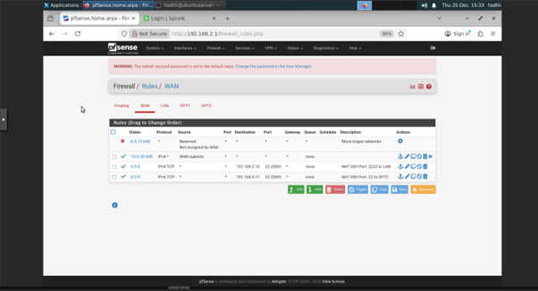
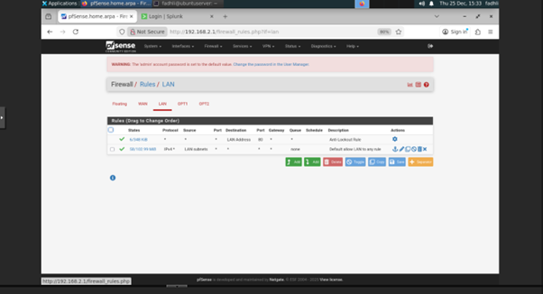
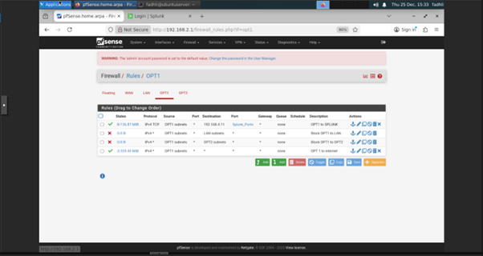
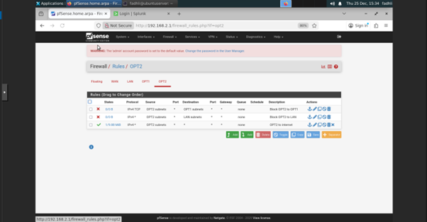

Once the lab was fully deployed and running the way I intended, I resisted the urge to immediately start writing documentation or pushing content to GitHub. Instead, I treated this phase as a pause a moment to capture the environment exactly as it existed before changes, tweaks, and experiments inevitably began.

This phase became the raw material collection stage. The goal wasn’t polish or presentation, but preservation. I wanted to lock in the current state of the lab while everything was still fresh, accurate, and stable, knowing that these references would later shape clean diagrams, explanations, and structured write-ups.

---

## ✅ Capturing the Lab in Its “Clean” State

While the environment was still stable, I began taking screenshots to document key design and security decisions. These visuals serve as evidence of how the lab was built and how segmentation is enforced.

### Captured Screenshots

#### Proxmox
- **Proxmox bridge configuration**

  

#### pfSense
- **Interface assignments**
- **Firewall rules segmentation**

**WAN**

  

**LAN**

  

**OPT1**

  

**OPT2**

  

---

### Virtual Machines Deployed Across All Segments

**LAN 1: Linux systems**

  

**LAN 2: Windows Server and Windows client**

- Windows Server 2016: windows server 

  

- Windows 10: WINDOWS  

  

**LAN 3: Splunk server**

  

---

### Splunk Logging

- Splunk actively receiving logs from multiple isolated segments  
- I set the treshold for data rentention of splunk keeping the logs for two days. For this homelab that threshold Is good enough for my environment. But for the enterprise that is not a good practise.  

**Server Splunk Forwarder**

  

**Windows Splunk Forwarder**

  

**Splunk UI**

  

These screenshots ensure that critical architectural and security choices are visually documented before any future changes are introduced.

---

## ✅ Writing Notes Before They’re Forgotten

Alongside screenshots, I kept simple technical notes nothing fancy, just accurate. The focus here was capturing details while they were still clear in my head, not making them look good.

### Network Flow
- WAN → Modem/Router → pfSense → Proxmox → Virtual Machines

### Segmentation Policy
- LAN1, LAN2, and LAN3 are fully isolated by default
- Explicitly allowed traffic:
  - LAN1 → Splunk (192.168.4.10)
  - LAN2 → Splunk (192.168.4.10)
  - LAN3 → Splunk (local)
- No direct LAN-to-LAN communication permitted

### Additional Notes
- Virtual machine names and assigned roles
- Firewall rule intent and reasoning
- Log flow direction across the environment
